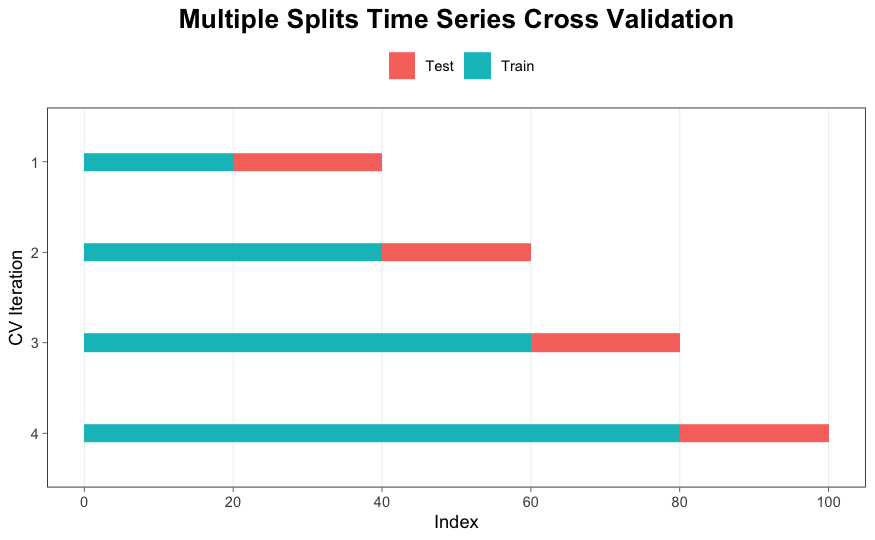
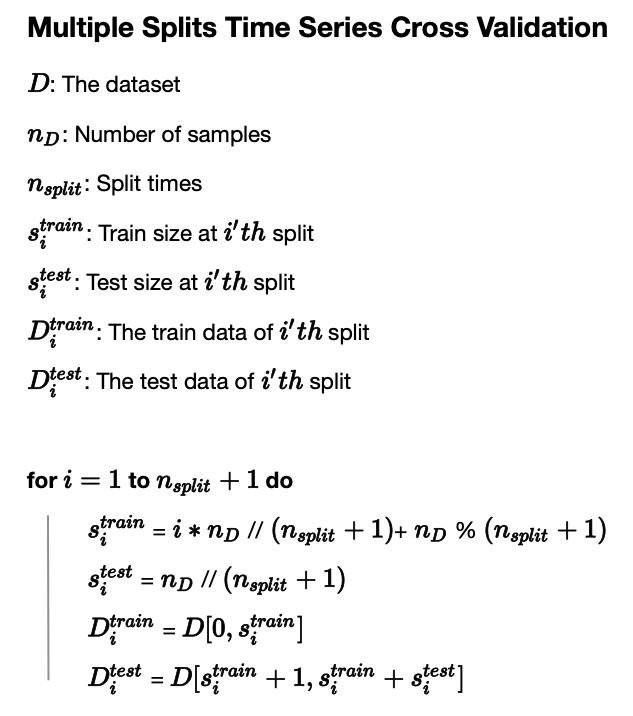
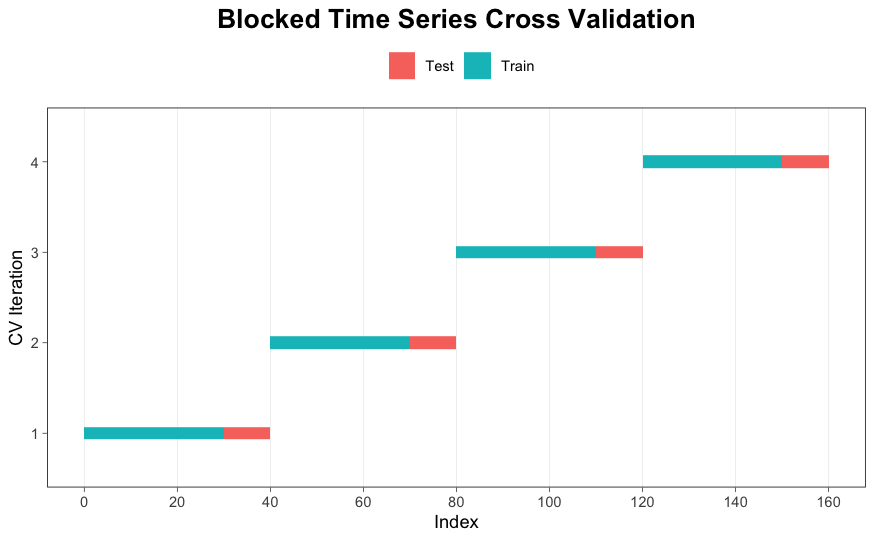
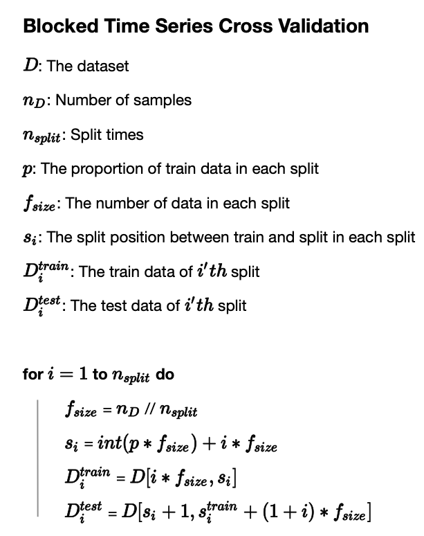
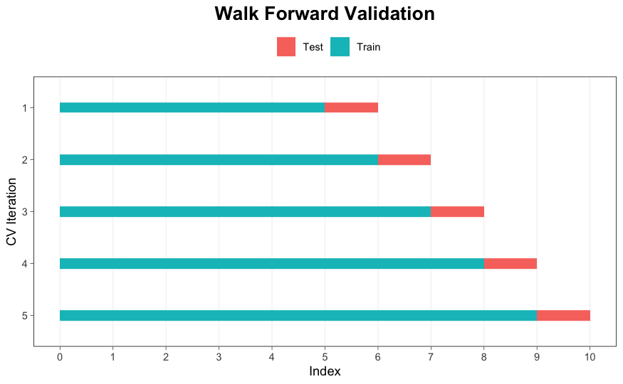
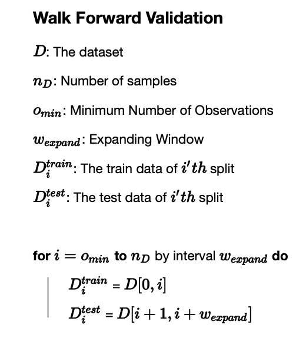

# Time Series Cross Validation
In time-series scenario, the dataset can't not be split randomly. We should keep:
* The test data always follows the training data.
* Each split should keep the order of time.

## Prerequisites

- Packages:  
  * numpy
  * pandas

## Files
- tsCrossValidation.py: Functions for Time Series Cross Validation.
- pic: Visualization and pseudo code for Time Series Cross Validation.

## Multiple Splits Cross Validation  
This Cross Validation is the same  with scikit-learn's TimeSeriesSplit. The length of test split is fixed depending on how many splits you want totally.  

---

## Blocked Time Series Cross Validation  
Compare with Multiple Splits Cross Validation, Blocked Time Series Cross Validation can avoid the potential data leakage from the future data. That's why Blocked Time Series Cross Validation is introduced.  

---

## Walk Forward Validation
Walk Forward Validation is the one which are very similar with the real world(time-series incremental data) scenario.  

---

## License

This project is licensed under the MIT License - see the [LICENSE](LICENSE) file for details.  

## Acknowledgments
[1]. https://machinelearningmastery.com/backtest-machine-learning-models-time-series-forecasting/     
[2]. https://hub.packtpub.com/cross-validation-strategies-for-time-series-forecasting-tutorial/        
[3]. https://scikit-learn.org/stable/modules/generated/sklearn.model_selection.TimeSeriesSplit.html  
